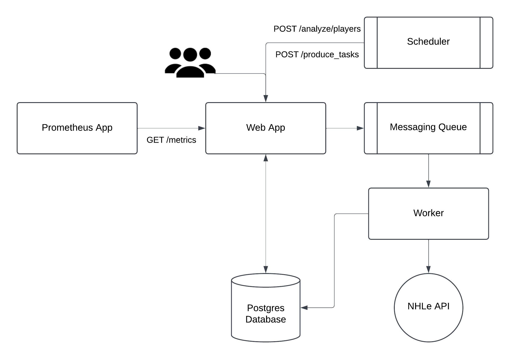

# Final Project Report

## What is it?
Driven by my interest in sports analytics, particularly hockey, I created a web app to start housing some basic player statistics with custom metrics. The web app consists of three pages:
    <ul> 
    <li>Homepage (`/`): A table of all teams that have an active roster, where clicking on a team directs the user to their current roster of players. </li>
    <li>Roster Page (`/team/{id}`): A table consisting of the teams current roster displaying each player's number, name and their career points. The player names are clickable and direct the user to the final page, the player profile.</li>
    <li>Player Profile (`player/{id}`): This is the basic reporting page, it displays the player's headshot, basic info and then two tables and a chart. The first table is their career regular season stats, the chart below is an interactive chart of their goals, assists and points over the current season, followed by a table showing the same game by game information.</li>
    </ul>

Currently, the stats on this page are fairly basic with most coming directly from the API itself. The calculated metrics here are percentile rank (points), points per game and goals per game.

### Prometheus App
While not a page on this app, I also hosted a prometheus server that scrapes metric info from the main app. The address and how to use it can be found in the readme.md in this repo.

## System Requirements

### Functional Requirements

#### Web App Features
As highlighted above, the three key features were displaying tables of teams, rosters and then displaying the player profile. I was able to test each of these pages with unit tests that leveraged patches and mocks to create fake data and ensure expected behaviors. 

Additionally, I was able to write an integration test that followed the journey from one page to testing the references were routing to correct rosters and players. This was to test the overall user experience.

#### APIs
This refers to both internal APIs (analyze and produce) and external APIs (NHLe); using unit tests and leveraging mocks and patches I was able to test the function wrappers for these APIs were producing the correct results.

#### Data Processing
The necessary behavior here was to analyze the data and then persist the results in the relational database. To do the majority of this, an internal API would publish a task to the queue where the worker would process the data by persisiting it in the database.

Additionally, I devised unit and integration tests to ensure that tasks were correctly produced to the queue and consumed correctly. This way I could confirm individual service outputs, but also the end-to-end experience was working as expected.

### Non-Functional Requirements

There were many non-functional requirements to this project, the key ones being performance, reliability and security. While not necessarily tests, monitoring in Prometheus and CI/CD setups in GitHub Actions were used to ensure these were safe.

#### Prometheus for Performance
I setup latency metrics to track the performance of requests, ensuring that the app is performant. 

#### GitHub Actions for Reliability
Using GitHub Actions provided CI/CD, ensuring that code was only deployed to the server after all tests passed. This meant that the likelihood of a bug taking down the page was lower protecting site reliability.

#### GitHub Secrets/Heroku Config for Security
GitHub Secrets and Heroku Config protect the security of the site's data by saving usernames, passwords and URIs as environment variables to restrict access to the database.

#### Cost
Given this is an early project, specifically for school, I didn't want to spend significant money on hosting. This served as a real world budget constraint where I had to consider the cost of tools as well. This was not very testable, the "testing" was me looking at pricing pages and seeing if they had student deals or free tiers.

### How I Refined Requirements
Below, I get into more specifics on the services and why I made design decisions for them. At a high level, the functional and non-functional requirements for this project really helped change and shape my project. My initial whiteboard architecture used Airflow, directly hit the NHLe API and used AWS. As I will explore below, all of these ended up negatively impacting the requirements above and forced me to pivot and refine my requirements.

## App Architecture

### Whiteboard Architecture Diagram

This diagram outlines the basic interaction of the key services, with the primary product environment for users being the Web App service. This diagram depicts many key services, which I will go into more detail about below but the high-level flow once the web app is live is as follows:
<ul>
<li>Heroku Scheduler will periodically run trigger scripts to post to the /analyze/players and /produce_tasks endpoints. The analyze/players endpoint calculates the percentile rank that a player is based on their points and updates that model in our database. The /produce_tasks endpoint produces a task and puts in the messaging queue.</li>
<li>The Web App serves primarly as the front-end for users to engage with the product, however, it does directly write to the database using the analyze/players endpoint.
<li>The Worker service is a Python script that runs on it's own Heroku dyno. This worker consumes messages from the messaging queue that direct it to hit API endpoints from the NHLe API and then write them to our postgres database. The intent of this is to not hit the NHLe API each time we want to request data and store that data ourselves.</li>
<li>The app uses a Heroku Postgres Database to persist data in our production environment. This stores information on players, teams, rosters and the percentile ranks we calculate.</li>
<li>The final piece of the diagram is the Prometheus App which is not really a service, rather it's own app. Hosted as a distinct Heroku app, the Prometheus App is setup to scrape from the /metrics endpoint to allow access to app metrics.</li>
</ul>

### Heroku Scheduler
In my original whiteboard diagram, I had selected Apache Airflow as my orchestration tool to schedule jobs. However, after spending more time becoming familiar with Heroku's platform I found the Heroku Scheduler had next to no setup required and provided the same result as Airflow. The reduced overhead to setup in addition to the seamless integration (uses the same repo), Scheduler made sense as my service of choice for orchestration.

Scheduler's role in my web app is to run the trigger scripts, `app/scripts/trigger_analyze.py` and `app/scripts/trigger_produce.py`. These scripts are used to update my data each day, so I run the produce script at 12AM PST and the analyze script at 1AM PST. This timing is done because I want to be sure I have the game data from the day prior (trigger_produce) when I run my analysis script so we are ranking up to date data. This is somewhere that Airflow could flourish in comparison given its ability to create job dependencies. However, the risk that comes with errors here is very low, if the process fails, our web app will still display the data from yesterday and remain up. A simple fix to this, would be to run the scheduler more than once a day, but for the sake of this exercise, there is no need.

Overall, Scheduler provided easier integration than CRON and lower overhead than Airflow making it the perfect candidate for our orchestration tool.

### Cloud AMQP (Messaging Queue)
Cloud AMQP servers as the messaging queue between the Web App and the Worker service. This archiecture ensure decoupling of services, which would support system scalablility and fault tolerance. I selected Cloud AMQP because it integrated nicely within Heroku and used RabbitMQ and pika, which I was familiar with. Given the messaging queue sits between two services, I will outline the interactions it has with the Web App and Worker seperately.
<ul>
<li>Web App: The App interacts with the Cloud AMQP service through the /produce_tasks endpoint. As discussed above, the Scheduler posts to the endpoint, which then creates a task in the queue. I made this decision to allow for scalability as I add more data sources and analysis functions to the app.</li>
<li>Worker Service: The Worker listens to the Cloud AMQP queue, then processes tasks as they are added, writing the results from the NHLe API to the Heroku Postgres Database. This design separates data-fetching operations from the Web App, preventing the app from being slow due to long running API calls.</li>
</ul>

### Worker Service
The Worker service runs in its own dyno on Heroku to ensure that it has its own resources to protect the Web App from any potential impact. The Worker listens to the Cloud AMQP server and ingests, processes and posts any incoming tasks. Currently, I only post one task to the queue `fetch_team_data` this is because we know if that task comes in, we need to fetch all the other roster, player and game data. So the Worker after processing, checks if there is another task in the order, and then posts it to the queue itself. It then ingests the new task and processes it, repeating the process until we have completed the ordered tasks. Processing a task consists of determining what function to run, then getting the data from the NHLe API and doing some calculations (per game stats), then pushing the data to the Postgres Database so the Web App service can also consume it. 

### Heroku Postgres Database
I selected Heroku Postgres for my persistent datastore for this web app for three primary reasons:
<ul>
<li>Consistency: I needed data to persist in the product environment so we didn't need to rely on external APIs for uptime or slow the page down by rerunning analysis queries each time. This meant we needed a database that would connect to the web app, meaning Heroku Postgres would work.</li>
<li>Integration: The primary reason was it integrates seamlessly with the Heroku platform. Since the course walked through Heroku hosting as I developed this app, it made sense to pick something that integrated well. The automatic connection of the database to the app through environment variables made this a lot easier than establishing connections to AWS or GCP.</li>
<li>Relational Structure: Given the highly relational structure between my data models, using a NoSQL database like MongoDB wouldn't have worked well. Postgres being relational was able to succeed in this situation and proved highly capable.</li>
</ul>

### GitHub Actions
Not depicted in the architecture diagram, but worth mentioning here. I used GitHub Actions for my CI/CD pipeline; it would create a test app, run my unit tests and integration tests and only if those passed, deploy the new code to Heroku.

### Prometheus App
While you can host a local prometheus app to scrape metric info from the web page, I chose to host my Prometheus service in a second Heroku app. This way, I could connect Grafana cloud to that persistent server and always have real time metrics. The only alternative I considered for monitoring was DataDog, however, Prometheus was both much easier to setup and had no cost making it an easy decision compared to an expensive DataDog service.
